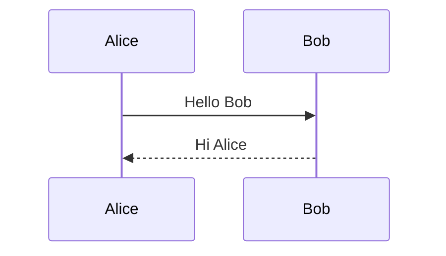

# Flow

```flow
st=>start: Start
op=>operation: Edit
cond=>condition: Done?
e=>end: End
st->op->cond
cond(yes)->e
cond(no)->op
```


```mermaid
sequenceDiagram
  Alice->>Bob: Hello Bob
  Bob-->>Alice: Hi Alice
```
